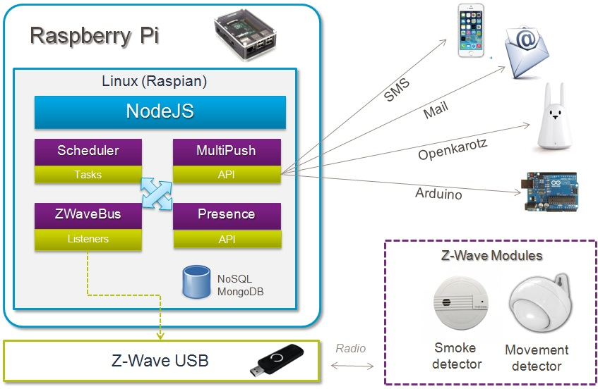
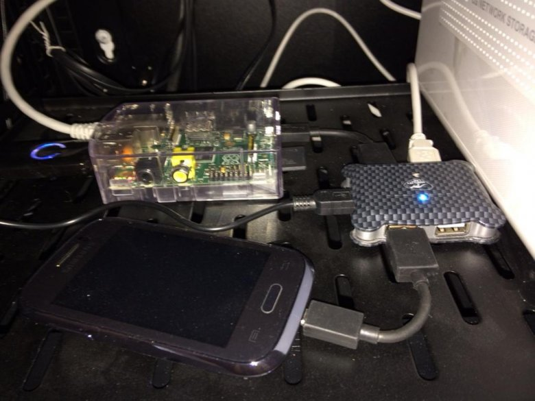

*DomoGeeek* is a set of Domotic apps based on Z-Wave / Raspberry Pi / NodeJS / MongoDB.

The goal of DomoGeeek is to provide a set of small modular applications to allow any geek to create their own domotic box quickly.
All the apps provided can be used separately. They can be modified and adapted without any difficulty.

**Note : These small NodeJS apps are fully experimental. You can use PM2 to start the apps and maintain them up.**

----

## GroupSMS 
*Exchanges SMS with your neighbourhood.*

The GroupSMS application allows people to subscribe and unsubscribe to SMS lists.
When a message is sent to the list by SMS, the message is also distributed to all the subscribers by SMS. GroupSMS is a kind of SMS Hub.
This application is useful to connect all your neighbours throw an SMS Mailing list.
This application uses an SMS Gateway. I use the Android SMS Gateway application to send and receive SMS freely.
All the messages and subscriptions are saved into a MongoDB database.

## ZwaveBus
*Captures and sends Z-Wave events on your Z-wave devices.*

The ZwaveBus application allows you to communicate with your Z-Wave devices. All the Z-Wave events received by the Raspberry Pi are transmit to an event bus developed in NodeJS.
You can quickly develop your own listeners that subscribe to specific Z-Wave events. Few lines of codes are enough to retrieve or submit some Z-Wave event.
There are currently 2 listeners available : Fibaro smoke detector and AEON LABS Multisensor. You can use them as sample to develop your own listener for your devices.
To understand what are the Command Class to listen, I recommend you to start the ZwaveBus with the debug options activated.
This project is based on the OpenZwave project and a NodeJS Wrapper.

## Multipush
*Broadcast text message on your devices.*

The Multipush application allows to broadcast messages on multiple communication channel : sms, mail, karotz, openkarotz ...
Multipush exposes a REST service easy to use to send a message quickly to any device.

## Presence
*Check human presence at your home*
 
The Presence applications allows to check if a known presence is inside your home. This application uses the Smartphone Wifi detection (using the Freebox API) and 
Karotz Tag to check if there is somebody known inside the home.
This application exposes a REST service that return who is inside the home: a known mobile device or a guest that used the Karotz RFID tag.
This application is used by the "Presence" module inside the ZwaveBus project to check when a movement is detected if their is a known person into the home.

## Scheduler
*Schedule tasks for you at your home*

The Scheduler app provides a tasks mechanism to schedule tasks like opening or closing the shutters automatically when your are in travel, reminder you when trash cans needs to be put outside the home.
This app is based on the cron module from NodeJS. You can easily add your own tasks in the tasks directory or extend the existing ones.

----
### Directory description

* apps : Contains NodeJS modular apps.
* vendor : Contains specific Node.js modules that need to be installed (npm install xxxx -g).
* libs  : Contains commons libraries shared by the apps.